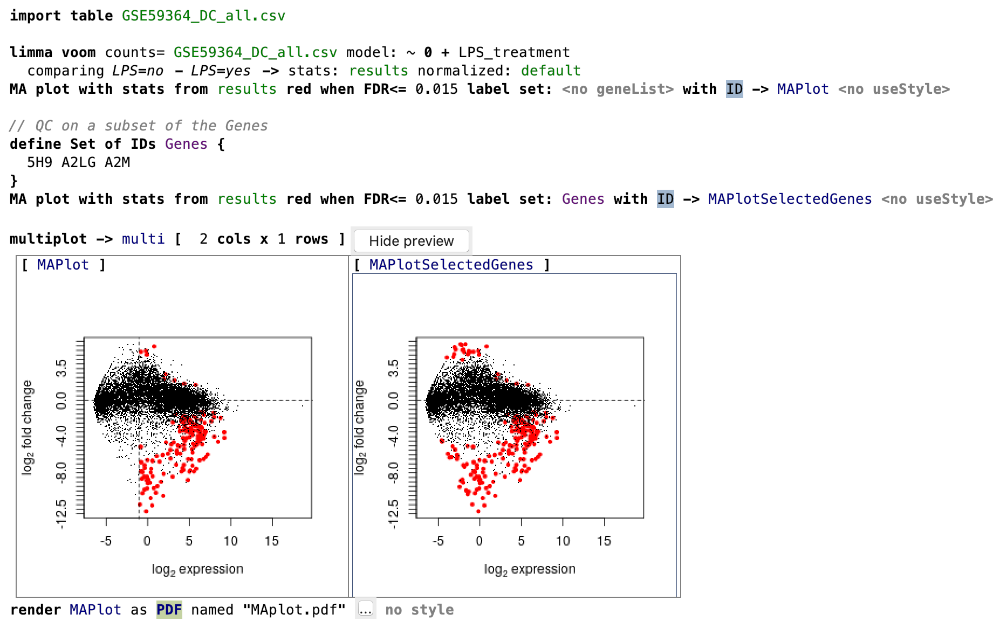

The plot visualizes the differences between measurements taken in two samples, by transforming the data onto M (log ratio) and A (mean average) scales, then plotting these values. Though originally applied in the context of two channel DNA microarray gene expression data, MA plots are also used to visualise high-throughput sequencing analysis

