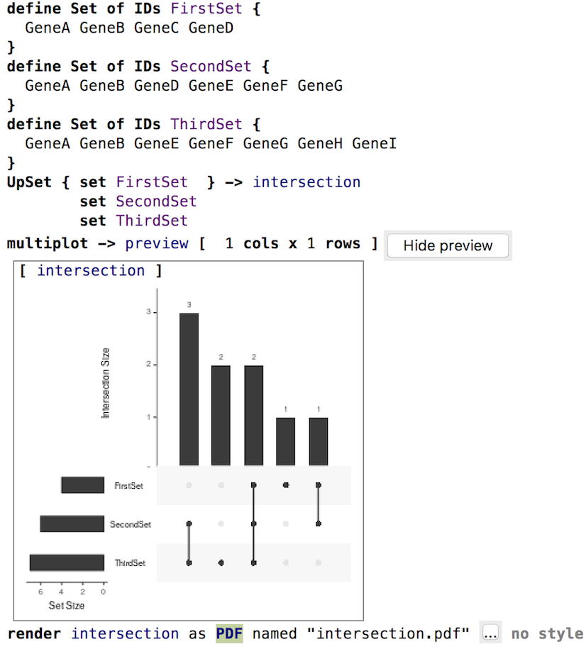

The UpSet technique visualizes set intersections in a matrix layout and introduces aggregates based on groupings and queries.
The matrix layout enables the effective representation of associated data, such as the number of elements
in the aggregates and intersections, as well as additional summary statistics derived from subset or element attributes.
This demo shows how to visualize common genes across 3 sets:

## Citation
If you use the UpSet statement in a paper, please cite:

> Jake R Conway, Alexander Lex, Nils Gehlenborg
> UpSetR: An R Package for the Visualization of Intersecting Sets and their Properties
> doi: https://doi.org/10.1093/bioinformatics/btx364